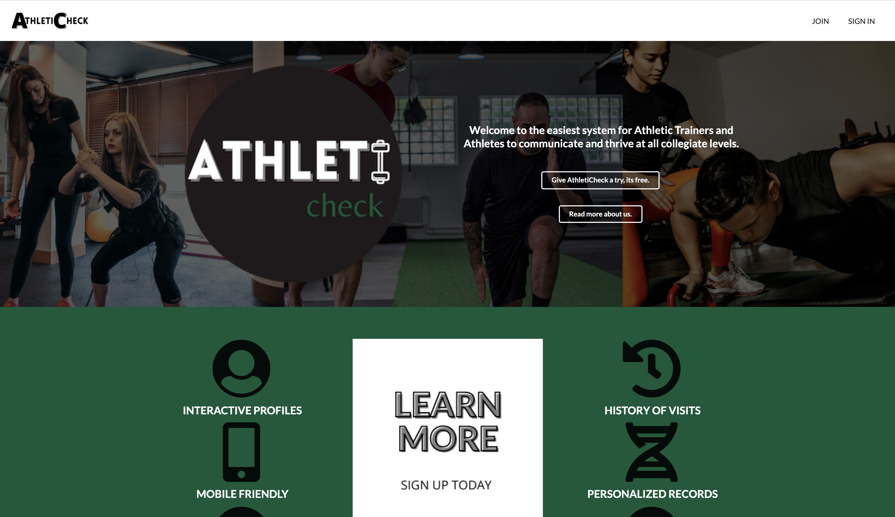
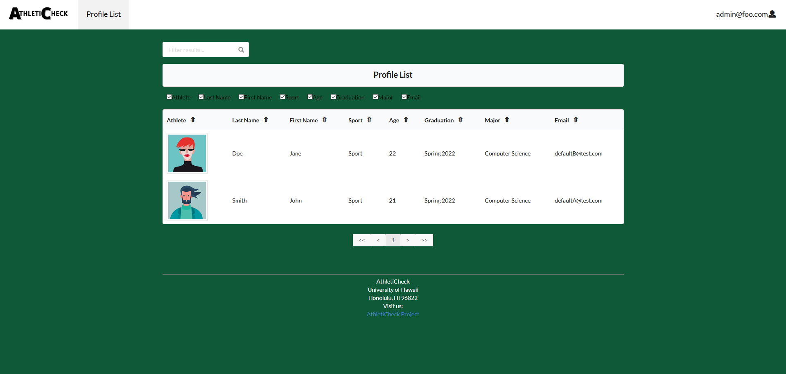
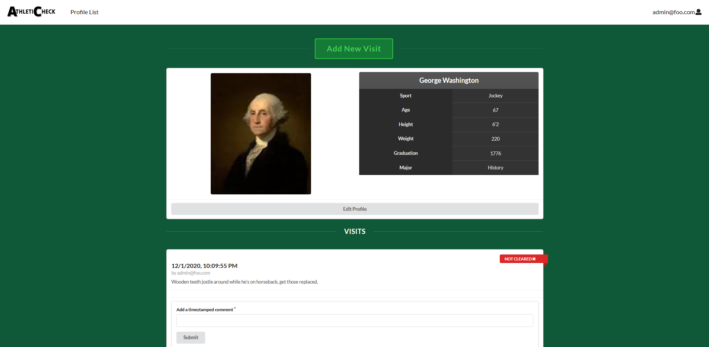

  
  
  
  

My software engineering group final project, a web application for communication between athletes and athletic trainers. One of the members on our development team is an athlete and they were dissatisfied with their current means of communication with athletic trainers. AtheltiCheck aims to be a simple and intuitive means for both athletes and trainers to share critical information such as appointment reports, athlete health clearance, and COVID clearance as well.

My main contribution to this project was development of the Profile List where admin level users could find all users registered in the system. The profile list subscribes to all profiles in the database and from this list, admin level users can get a quick overview of simple user info as well as link to specific profiles. In the final phase of development, the profile list was executed via a plugin and the hardest part of the project was integrating the plugin with my existing code. The table sorts, filters results, and toggles table information.

Through this project, the most valuable skills I practiced were working with git, collaborating with others in software development, and independent research to troubleshoot programming issues. It was often frustrating, but very satisfying and I am proud of what my group came together to develop. 

GitHub Repository: <a href="https://github.com/athleticheck/athleticheck"><i class="large github icon "></i>andyyu824/AthletiCheck</a>

Github IO: <a href="https://athleticheck.github.io/"><i class="large github icon "></i>athleticheck.github.io</a>

Site: <a href="athleticheck.xyz/">AtheltiCheck.xyz</a>
