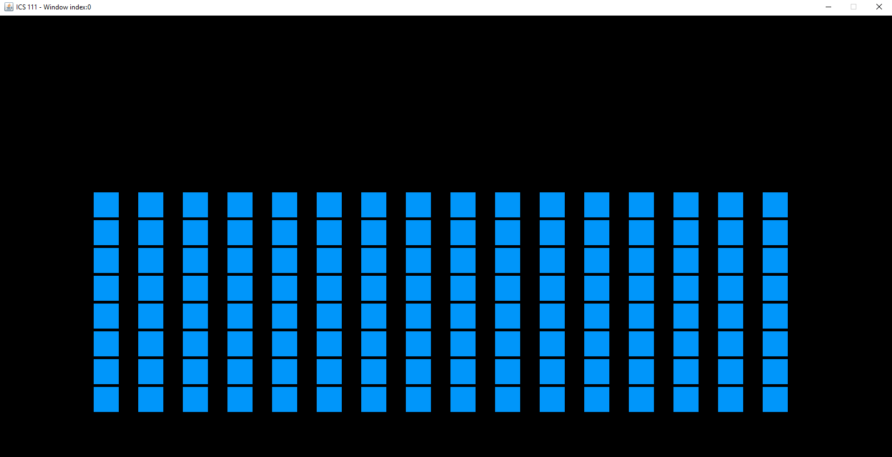
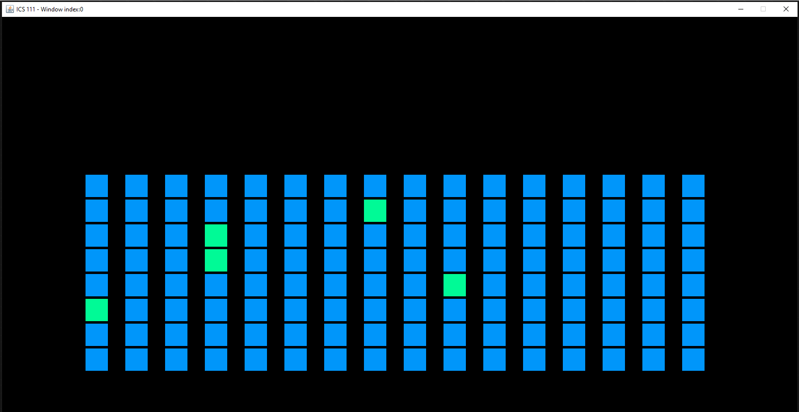

  
  

My first ever computer science project was the final project of ICS 111 – Introduction to Computer Science. This project required students to both compile the skillset accumulated throughout the semester as well as collaborate with group members. My group decided on creating a soundboard or drum machine. Our initial vision of the finished product was an ambitious GUI rivaling those that we found online, but numerous hiccups along the way resulted in us keeping the project very simple. Although it was disappointing, I learned a lot about working with others in software development. 

The project may have been simple, but communicating ideas and compromising was often not. Even if we discussed our ideas at length, everyone had a different idea of what the final product was supposed to look like. Obstacles like those really inhibited the actual coding portion of our work and it was not until we had a visual that we were finally able to make actual progress. Everyone came into the project with a different skill level and expectations and the same can be said for any software development project. These lessons have been valuable to me and that is why I am showcasing my very modest first ever group computer science project.

GitHub Repository: <a href="https://github.com/fredstraub/soundboard"><i class="large github icon "></i>SoundBoard</a>

