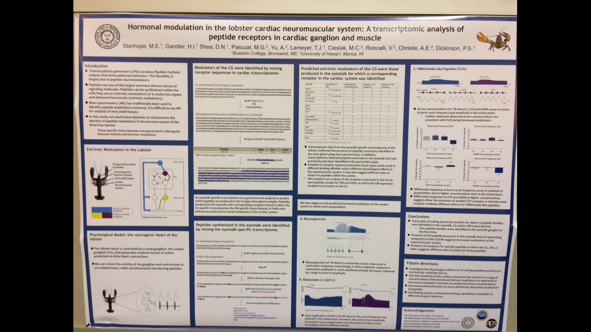

  

The objective of this project was to determine the presence or absence of an intrinsic circadian clock in the heart of the H. americanus. Here, a lobster cardiac ganglion transcriptome was mined for the complement of proteins that compose a circadian clock. I worked in a dry lab using a series of freeware to analyze lobster transcriptome sequences to identify these key proteins.

Although presenting at the UROP Spring Showcase was the original goal, this project was a small piece of our lab's larger objectives which in 2018 resulted in a publication in the journal of General and Comparative Endocrinology and a poster presentation at The Society for Integrative & Comparative Biology.

